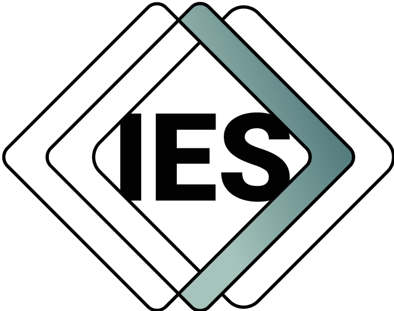

#  IES Governance

**Repository:** `ies-governance`  
**Description:** `Governance records, roadmaps, decisions, and administrative artefacts for the IES Steering Group`

This repository defines the governance framework for IES, the Information Exchange Standard.

It establishes how IES is guided, developed, maintained, and released. It also provides a single governance reference for roles, responsibilities, processes, and repository ownership across the IES GitHub organisation.

Governance-related information is organised into four core areas:

* **Charter** - the purpose, principles, and overall governance model
* **Roles** - the groups and individuals responsible for governing, developing, and maintaining IES
* **Processes** - the mechanisms through which changes are proposed, developed, managed, and released
* **Ontology Index** - the index of IES repositories and their maintainers

A shared glossary is also provided to support consistent interpretation across the governance framework.

---

## Repository Structure

### Charter

The Charter defines the foundational principles and overall governance model for IES.

It explains the purpose and scope of governance, how responsibilities are distributed, and how governance evolves over time.

**Contents:**

* [Principles](./charter/principles.md)
* [Governance Model](./charter/governance-model.md)

---

### Roles

The Roles section defines the governance structure for IES, including both governance groups and the individual roles that operate within them.

Governance is organised through a set of coordinated groups, each with clearly defined responsibilities, authority, and decision-making capacity. Within each group, specific roles are defined to support leadership, representation, development, maintenance, and delivery.

Each group and role described below links directly to the relevant section of the documentation, including visibility of current role-holders where applicable.

---

#### Steering Group

The Steering Group provides overall strategic oversight and governance for IES.

It is responsible for ensuring that IES remains aligned with its purpose, principles, public interest obligations, and long-term direction.

* [Steering Group Overview](./roles/steering-group/overview.md)
* [Steering Group Membership](./roles/steering-group/membership.md)
* [Current Voting Members](./roles/steering-group/voting-members.md)
* [Current Advisory Members](./roles/steering-group/advisory-members.md)
* [Past Steering Group Members](./roles/steering-group/past-members.md)

---

#### Domain Working Groups

Domain Working Groups are responsible for domain-driven development within IES.

They provide subject matter expertise, identify domain-specific requirements, and support the development of domain-specific ontology extensions that align with IES Top and IES Core.

Domain Working Group membership is not published in full. The governance documentation publishes active Domain Working Groups and official role-holders where appropriate, such as Chairs and Representatives.

* [Domain Working Groups Overview](./roles/domain-working-groups/overview.md)
* [Domain Working Group Membership](./roles/domain-working-groups/membership.md)
* [Active Domain Working Groups](./roles/domain-working-groups/active-groups.md)
* [Domain Working Group Chair](./roles/domain-working-groups/overview.md#chair)
* [Domain Working Group Representative](./roles/domain-working-groups/overview.md#representative)
* [Domain Working Group Official Role-Holders](./roles/domain-working-groups/official-role-holders.md)

---

#### Technical Support and Maintenance

Technical support and maintenance functions ensure the technical integrity, continuity, and accessibility of IES.

This area distinguishes between several different types of maintenance responsibility. In particular, it distinguishes between the tightly governed role of maintaining IES Top and IES Core, and the broader role of maintaining individual repositories.

* [Technical Support and Maintenance Overview](./roles/technical-support-and-maintenance/overview.md)

##### IES Top (Layer 0) Ontology Maintainers and IES Core (Layer 1) Ontology Maintainers

The IES Top (Layer 0) Ontology Maintainers and IES Core (Layer 1) Ontology Maintainers are responsible for maintaining **IES Top** and **IES Core**.

These repositories provide the common foundation on which domain-driven ontology development depends. Changes to IES Top or IES Core can affect all domain extensions and are therefore subject to stricter governance.

##### Repository Maintainers

Repository Maintainers are responsible for maintaining specific IES repositories.

Most repository maintainers are expected to work within domain-driven repositories. Their permissions and responsibilities are normally limited to the repositories they support.

Repository Maintainer details are not maintained centrally in this governance repository. Each repository is expected to maintain its own maintainer file, which identifies the people responsible for that repository.

##### Platform and Communications Management

The Platform and Communications function is responsible for managing the IES GitHub organisation and supporting communications associated with governance, development, and release activity.

This includes the GitHub Organisation Custodian role.

* [Platform and Communications Overview](./roles/technical-support-and-maintenance/platform-and-communications/overview.md)
* [Platform and Communications Membership](./roles/technical-support-and-maintenance/platform-and-communications/membership.md)
* [Current Platform and Communications Team](./roles/technical-support-and-maintenance/platform-and-communications/current-platform-and-communications-team.md)
* [Past Platform and Communications Team](./roles/technical-support-and-maintenance/platform-and-communications/past-platform-and-communications-team.md)

---

### Processes

The Processes section defines how governance operates in practice.

It covers the procedures through which proposals are made, participants are onboarded or offboarded, development is conducted, repositories are named and managed, and outputs are released.

Processes are grouped into a small number of categories to maintain clarity and consistency.

---

#### Proposals

Proposal processes define how changes are suggested, assessed, approved, rejected, or deferred.

* [Proposal Lifecycle](./processes/proposals/proposal-lifecycle.md)
* [Proposal Template](./processes/proposals/proposal-template.md)

---

#### Onboarding and Offboarding

Onboarding and offboarding processes define how individuals, organisations, and groups enter or leave governance and development roles.

* [Onboarding](./processes/onboarding-offboarding/onboarding.md)
* [Offboarding](./processes/onboarding-offboarding/offboarding.md)

---

#### Development

Development processes define how work on IES is undertaken.

The IES GitHub organisation is the authoritative location for IES development. Work undertaken outside the IES GitHub organisation, including work on private machines, private forks, or external systems, is not considered part of an official IES version unless and until it is proposed, reviewed, accepted, and merged through the appropriate governance and development processes.

* [Development Overview](./processes/development/README.md)
* [Development Rules](./processes/development/development-rules.md)
* [Repository Naming](./processes/development/repository-naming.md)

---

#### Public Release

The public release process defines how approved IES outputs are prepared and made available.

* [Release Process](./processes/public-release/release-process.md)

---

### Ontology Index

The Ontology Index provides an index of repositories in the IES GitHub organisation, including ontology repositories and administrative repositories relevant to IES governance, management, development, and release.

It identifies the repositories that make up or support IES, the type of repository, the domain or group responsible for it, and where maintainer information is published.

IES repositories are organised into four broad categories:

1. **IES Top**
   The single Top-level ontology repository.

2. **IES Core**
   The single Core ontology repository.

3. **Domain-driven repositories**
   Repositories managed through domain-driven development, normally aligned to a specific domain.

4. **Administrative repositories**
Repositories containing governance, management, planning, coordination, or informational material relating to IES. These repositories do not contain ontology content and are not part of IES Top (Layer 0) and IES Core (Layer 1) or any domain-driven ontology extension. They may nevertheless be authoritative for the governance, operation, roadmap, or management of IES.

Maintainer details for individual repositories are published in the relevant repository’s maintainer file. IES Top (Layer 0) Ontology Maintainers and IES Core (Layer 1) Ontology Maintainers details are maintained centrally because IES Top and IES Core are subject to stricter governance.

**Contents:**

* [Ontology Index Overview](./ontology-index/README.md)
* [Domain Repositories](./ontology-index/domain-repositories.md)
* [Administrative Repositories](./ontology-index/administrative-repositories.md)

---

### Glossary

A shared glossary of governance terms is maintained to ensure consistency across all documentation.

* [Glossary](./glossary.md)

---

## Using this Repository

* Start with the **Charter** to understand the purpose, principles, and governance model
* Refer to **Roles** to understand responsibilities, authority, membership, and decision-making
* Use **Processes** to follow how changes, development, onboarding, and release activities are carried out
* Use the **Ontology Index** to identify repositories, repository types, responsible groups, and where maintainer information is published
* Consult the **Glossary** for definitions of key terms

This structure is designed to be clear, navigable, and extensible as IES evolves.

## Acknowledgements

This repository has benefited from collaboration with various organisations. For a list of acknowledgments, see [ACKNOWLEDGEMENTS.md](ACKNOWLEDGEMENTS.md).

## Changelog

See [CHANGELOG.md](CHANGELOG.md) for a list of changes in each release.

## Contributions and Feedback

We welcome:

- Feedback and structured suggestions
- Bug reports and clarifications
- Requests for extensions or additional documentation

Please see:

- [CONTRIBUTING.md](CONTRIBUTING.md) for contribution guidelines
- [CODE_OF_CONDUCT.md](CODE_OF_CONDUCT.md) for expected behaviour and reporting concerns
- [MAINTAINERS.md](MAINTAINERS.md) for maintainer contact information

## Security and Responsible Disclosure

We take security seriously. If you believe you have found a security vulnerability in this repository, please follow our responsible disclosure process outlined in [SECURITY.md](SECURITY.md).

---

**Maintained as part of the Information Exchange Standard initiative.**

© Crown Copyright. This work forms part of the Information Exchange Standard initiative and is currently under the custodianship of the UK's Department for Business, Innovation, Science and Trade (BIST), acting on behalf of a cross-government group of stakeholders.
  
Licensed under the Open Government Licence v3.0.

For full licensing terms, see [OGL_LICENSE.md](OGL_LICENSE.md).